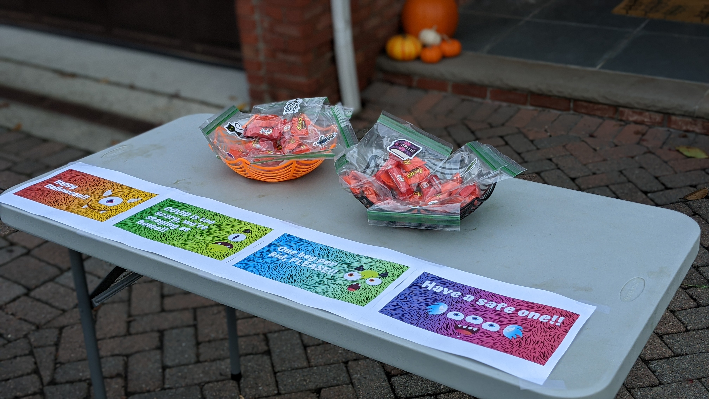
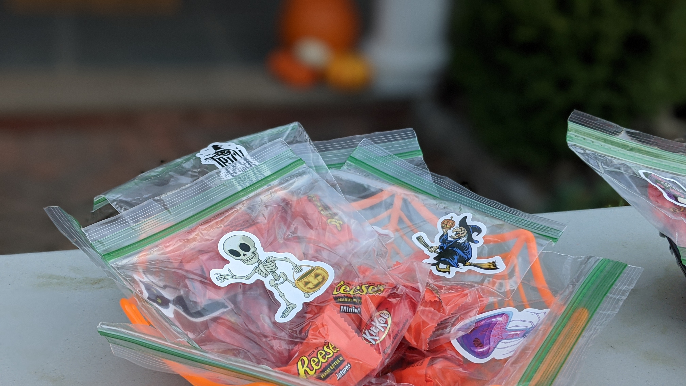

## Welcome!

This is a website created for the 4th homework assignment of Data Science I.

## A Brief Introduction of Myself

I am currently a research specialist working in the lab studying macrophage biology and functional genomics in cardiometabolic diseases at CUIMC.
(Here is the link to our lab website: [Zhang Lab @ Columbia](https://hanruizhang.github.io/zhanglab/))

Thanks to the research project about CRISPR Screen I've been closely involved in. I have the opportunities to start and learn coding with Python and R, which made me get to know data science, fall in love with data and startled at the power of data!

## More about Myself

Please move your cursor to the tab on the top right.

Run into the [About me](about.html) tab!

Follow me on github, linkedin! 

Send me an email!

## Something fun

Look at our Halloween decoration this year!

And our first Halloween being trick-or-treated:

